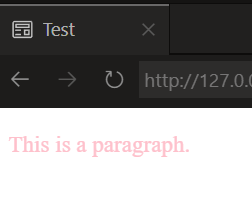

## Calculate the specificity for each of the following css property

```css
p {color: green;}               (0,0,1)
div p {color: blue;}            (0,0,2)
#container p {color: red;}      (1,0,1)
.container p {color: orange;}   (0,1,1)
[id] p {color: yellow;}         (0,1,1)
```


## Sort the rules in descending order and predict the effect of the css

Ordered commands
```css
#container p {color: red;}      (1,0,1)
.container p {color: orange;}   (0,1,1)
[id] p {color: yellow;}         (0,1,1)
div p {color: blue;}            (0,0,2)
p {color: green;}               (0,0,1)
```
html
```html
<div id="container" class="container"> 
    <p>This is a paragraph.</p> 
</div>
```
Predicted behaviour: The text in the paragraph will be red.
<details>
<summary>Result Spoiler ⚠️</summary>
Hurray


</details>

## What would happen if the <p> element had a **style** attribute with content `color: pink;`?

- The finds a css conflict whithin the p element 
- Checks the origins but finds that the conflicted rules are still in the same bucket (both are authored).
- Checks the layer and finds that the `color: pink` is in the inline layer which is more important so selects that one. So it wins.

<details>
html
<summary>Result Spoiler ⚠️</summary>

```html
<div id="container" class="container"> 
    <p style="color: pink">This is a paragraph.</p> 
</div> 
```

</details>

## Add `!important` in the style attribute in the html document. What happens?

- Nothing happens, it's still the same bucket and in the inline layer which is more important

## If you wanted to override this, how would you do it if you had to add a new rule to the authored css?

- I believe the only way is to add another `color: <color> !important` in the inline after the first one, so that they are in the same bucket, same layer and have the same importance. In this case, the last one is considered.


Correct me if I'm wrong!